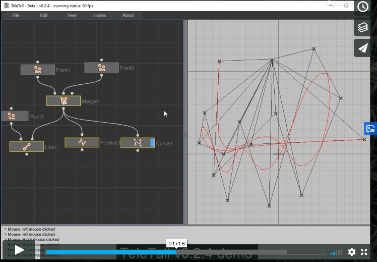

# :radio_button: TeleTall 

This a repo for my Capstone project in the [Udacity C++ Nanodegree Program](https://www.udacity.com/course/c-plus-plus-nanodegree--nd213). The Capstone Project is a chance to integrate what I've learned throughout this program. Find all the info on website:**[Teletall's Wiki](https://github.com/JunruTao/Udacity.Cpp.Capstone.Project/wiki)**
* :pushpin:**Capstone Option:** :one: + :two:
  * <sup>The type:</sup> 
  
  |_**A simple node-based procedural 2D modelling application**_|
  |---|

* :pushpin:**Program Preview:**

  | |
  |---|
  | watch the demo video of TeleTall v0.2.4 here &darr;|
  |[](https://vimeo.com/442819000 "TeleTall v0.2.4 Demo Video")|


  

* :pushpin:**Program Structure:** _* partial_
> 1. Initial Design
> 

> 2. Detail Diagram explaining the nodes and thread
> 

* :pushpin:**Rubric Points addressed:**

> **1. Loops, Functions, I/O**
> * ✔️ The project demonstrates an understanding of C++ functions and control structures.
> * ✔️ The project reads data from a file and process the data, or the program writes data to a file.
> * ✔️ The project accepts user input and processes the input.

> **2. Object Oriented Programming**
> * ✔️ The project uses Object Oriented Programming techniques.
> * ✔️ Classes use appropriate access specifiers for class members.
> * ✔️ Class constructors utilize member initialization lists.
> * ✔️ Classes abstract implementation details from their interfaces.
> * ✔️ Classes encapsulate behavior.
> * ✔️ Classes follow an appropriate inheritance hierarchy.
> * ✔️ Overloaded functions allow the same function to operate on different parameters.
> * ✔️ Derived class functions override virtual base class functions.
> * ✔️ Templates generalize functions in the project.

> **3. Memory Management**
> * ✔️ The project makes use of references in function declarations.
> * ✔️ The project uses destructors appropriately.
> * ✔️ The project uses scope / Resource Acquisition Is Initialization (RAII) where appropriate.
> * ✔️ The project follows the Rule of 5. (Point3D)
> * ✔️ The project uses move semantics to move data, instead of copying it, where possible.
> * ✔️ (Mixed) The project uses smart pointers instead of raw pointers.

> **4. Concurrency**
> * ✔️ The project uses multithreading.
> * ⚪ A promise and future is used in the project.
> * ✔️ A mutex or lock is used in the project.
> * ⚪ A condition variable is used in the project.
***


### :white_circle: User's Program Guide

##### 💡 1.Start: Viewport and Window
|<sup>:notebook: notes:</sup>|
|:---|
|The viewport on the left is called `TelePad` which is the context for holding and creating `Tele-Nodes` and their connections; the one on the right is `Tall` viewport2D, rendering the geometries. Once OpenGL is introduced, a GL-3D viewport will replace `Tall`.|
  * 🖱️`Left mouse button`: click and drag to **move assets and UI elements**.
  * 🖱️`Right mouse button`: click and drag to **nevigate** around the viewport space; 
  * 🖱️`Middle mouse wheel`: scrole to **zoom in / out** `Tall` viewport space; 
  * ⌨️"`H`" key, to **'home'** the viewport grid back to its origin (0,0).
  * ⌨️"`F`" key, to **'Frame'** all the geometries or nodes to the screen centre.
    * >  they all works for both viewport: `TelePad` (node viewport) and `Tall` (geometry viewport).
  * ⌨️"`ctrl`+ `;`" to **show and hide the console**;

    ---

##### 💡 2.Edit: Tele-Pad and Nodes

|<sup>:notebook: notes:</sup>|
|:---|
|You can create nodes from the top menu under `Nodes` submenu. To create a basic **PointNode**, you can also use a short cut:|


  * ⌨️"`P`" key:  a **PointNode** will be created at mouse location.
  * 🖱️`Left mouse button` click or drag empty area: to select a node/nodes.
  * ⌨️"`Delete`" key: delete selected node/nodes.
  * ⌨️"`Ecs`" key: clear selection of node/nodes.

|<sup>:notebook: notes:</sup>|
|:---|
|For each **Telenodes**, a `display flag` indicates whether this node is now rendering at `Tall`. There is only maximum _one_ display flag will be allowed in the telepad node-viewport.|

  * ⌨️"`D`" key: toggle on display, shift `display flag` from one to another.
  * 🖱️`Left mouse button` **double-click on the node** to shift `display flag` from one to another.

|<sup>:notebook: notes:</sup>|
|:---|
|If a **Telenode** is a `editable node` such as **PointNode**, you can manipulate its data. You will be able to `create`/`select`/`transform`/`delete` when entering **Edit Mode**. This mode will lock the `Telepad` which will turn into a red theme and enable editable feartures in `Tall` viewport.|
  * ⌨️"` space `" key: Enter/Exit the **Edit Mode**.
  * ⌨️"`Return ↵`" key: Enter the **Edit Mode**.
  * ⌨️"`Ecs`" key: Exit the **Edit Mode** or clear selection.

    ---
##### 💡 3.Create and Edit Geometry: Points

|<sup>:notebook: notes:</sup>|
|:---|
| **Point Node** is a `editable node`, when one **Point Node** is seleted and it has been entered **Edit Mode**, you can create points, delete points, move points. However, if this node **already had an input, you won't be able to enter edit mode**; this **Point Node** will behave as a _'Point Relay'_, which functions as a relay object passing the same point data from upper stream. |

  * 🖱️`Left mouse button`: <ins>**double-click**</ins> to **create points**.    &larr;`tall`
  * 🖱️`Left mouse button`: <ins>**single-click and drag**</ins> to **move points**.    &larr;`tall`
  * ⌨️"`Ctrl`+`Z`" keys(or undo in menu): **delete** last created point.    &larr;`tall`
  * ⌨️"`X`" key: toggle on/off **Grid Snap**.    &larr;`tall`


##### 💡 4.Creative: Tele-Nodes Dictionary

|<sup>:notebook: notes:</sup>|
|:---|
| You can create all the node from the menu tab `menu`&rarr;`Nodes`&rarr;`Point Node ...`. The current version which is `v.0.2.4` has very basic node category. They are listed down below. |
  * ** Point Node** creates points in the tall viewport. Point data will be stored in this node.
  * ** Merge Node** Theoretically, merge node can merge any node type's outputs, however here is a bug not yet fixed in `v0.2.4` of teletall. It will not crash merging points, however if merging different types or other types more than 2 entries, the program will crash. If you do have the solution, please comment below in the issue section.
  * ** Line Node** Takes 2 inputs `A` & `B` entries, both should be point type. The ideal design is a "Long List" solution, that a shorter list of points will repeat its last item and link to the remained points in the longer list. However, too much amount of point data will also crash so how. This issue is not yet fixed in `v0.2.4`. 
  * ** Polyline Node** interpolate a group of points into polyline. One input allowed.
  * ** Curve Node** interpolate a group of points into cubic b-spline curve. One input allowed.
***


### :red_circle: Dependencies for Running Locally
* **cmake** >= 3.7
  * All OSes: [click here for installation instructions](https://cmake.org/install/)
* **make** >= 4.1 (Linux, Mac), 3.81 (Windows)
  * Linux: make is installed by default on most Linux distros
  * Mac: [install Xcode command line tools to get make](https://developer.apple.com/xcode/features/)
  * Windows: [Click here for installation instructions](http://gnuwin32.sourceforge.net/packages/make.htm)
* **SDL2** >= 2.0
  * All installation instructions can be found [here](https://wiki.libsdl.org/Installation)
  * Note that for Linux, an `apt` or `apt-get` installation is preferred to building from source. [Linux-tutorial: SDL2](https://lazyfoo.net/tutorials/SDL/01_hello_SDL/linux/index.php)
* **SDL2_image** >= 2.0
  * All installation instructions can be found [here](https://www.libsdl.org/projects/SDL_image/)
  * Note that for Linux, an `apt` or `apt-get` installation is preferred to building from source. [Linux-tutorial: SDL_image](https://lazyfoo.net/tutorials/SDL/06_extension_libraries_and_loading_other_image_formats/linux/index.php)
* **SDL2_ttf** >= 2.0
  * All installation instructions can be found [here](https://www.libsdl.org/projects/SDL_ttf/)
  * Note that for Linux, an `apt` or `apt-get` installation is preferred to building from source. [Linux-tutorial: SDL_ttf](https://stackoverflow.com/questions/40368368/sdl2-ttf-error-on-ubuntu)
* **gcc/g++** >= 5.4
  * Linux: gcc / g++ is installed by default on most Linux distros
  * Mac: same deal as make - [install Xcode command line tools](https://developer.apple.com/xcode/features/)
      > This program was not yet tested building on Mac OS, be sure you follow the xcode instructions, and find the missing packages such as thread and SLD.h
  * Windows: recommend using [MinGW](http://www.mingw.org/)
      >  For windows users, make sure after download, using <ins>*MinGW Installation Manager*</ins> to install <ins>*mingw32-pthread-w32-dev*</ins> package or find c++ standard library of threading for MinGW from their websites!
***
### :large_blue_circle: Basic Build Instructions

* **Linux:**
  1. Clone this repo.
  2. Make a build directory in the top level directory: `mkdir build && cd build`
  3. Compile: `cmake .. && make`
  4. Run it: `./${ProjectName}`

  **<strong><em>! Important:</strong></em>** 
  * <ins>Because the environment that this project was developed was based in Window OS, therefore if you are building on Lunix System, Plese make sure you do the following things with the **source code**:</ins>

  | list |     Code Needed to Adjust              |    to  | Changed           |
  | :---  | ------------------------------------- | ---    | ----              |
  | 1.  | under`source/` in `x_sld2headers` and `x_threadheaders.h`, change all  **`#define _WINUSER_ `<s>`1`</s>** | &rarr; | `#define _WINUSER_ 0` |

* **Windows:**
  1. Clone this repo.
  2. Make a build directory in the top level directory: `mkdir build` then `cd build`, two commands
  3. Compile: `cmake.exe -G "MinGW Makefiles" .. `
  4. Build(make): `mingw32-make` 
  5. Run it: `./${ProjectName}`
    ___

* :warning: ***After successfully built, please copy all the subfolders in `.package.extra.merge` folder which contains the fonts and icons into your build directory.***


***

### :white_circle:License

|:key: _[Copyright ©Junru Tao 2020 License ](https://github.com/JunruTao/Udacity.Cpp.Capstone.Project/blob/master/LICENSE)_|
| ---|

----------------------------------------------------------------

### :white_circle:Releases
* [32bit win TeleTall Beta Version -v0.2.4](https://github.com/JunruTao/Udacity.Cpp.Capstone.Project/releases/tag/v0.2.4)
* [32bit win TeleTall Beta Version -v0.2.0](https://github.com/JunruTao/Udacity.Cpp.Capstone.Project/releases/tag/v0.2)
* [32bit win TeleTall Beta Version -v0.1.0](https://github.com/JunruTao/Udacity.Cpp.Capstone.Project/releases/tag/v0.1)


*****************************************************************
## :black_circle:Production Logs:

You can find the log in [Teletall's Wiki](https://github.com/JunruTao/Udacity.Cpp.Capstone.Project/wiki)

| Sun | Mon | Tue | Wed | Thu | Fri | Sat |
| :---: | :---: | :---: | :---: | :---: | :---: | :---: |
|    |   |    |     |<sup>1</sup> ✔️[20/7/9](https://github.com/JunruTao/Udacity.Cpp.Capstone.Project/wiki/Log-DAY-1) | <sup>2</sup>✔️[20/7/10](https://github.com/JunruTao/Udacity.Cpp.Capstone.Project/wiki/Log---DAY-2) |<sup>3</sup>✔️[20/7/11](https://github.com/JunruTao/Udacity.Cpp.Capstone.Project/wiki/Log--DAY-3) |
| <sup>4</sup>✔️[20/7/12](https://github.com/JunruTao/Udacity.Cpp.Capstone.Project/wiki/Log-DAY-4) | <sup>5</sup>✔️[20/7/13](https://github.com/JunruTao/Udacity.Cpp.Capstone.Project/wiki/Log-DAY-5) |<sup>6</sup>✔️[20/7/14](https://github.com/JunruTao/Udacity.Cpp.Capstone.Project/wiki/Log-Day-6) | <sup>7</sup>✔️[20/7/15](https://github.com/JunruTao/Udacity.Cpp.Capstone.Project/wiki/Log-Day-7) |        <sup>8</sup>✔️[20/7/16](https://github.com/JunruTao/Udacity.Cpp.Capstone.Project/wiki/Log-Day-8) |    <sup>9</sup>20/7/17 |      <sup>10</sup>✔️[20/7/18](https://github.com/JunruTao/Udacity.Cpp.Capstone.Project/wiki/Log-Day-10) |
|      <sup>11</sup>✔️[20/7/19](https://github.com/JunruTao/Udacity.Cpp.Capstone.Project/wiki/Log-Day-11) |        <sup>12</sup>✔️[20/7/20](https://github.com/JunruTao/Udacity.Cpp.Capstone.Project/wiki/Log-Day-12) |      <sup>13</sup>✔️[20/7/21](https://github.com/JunruTao/Udacity.Cpp.Capstone.Project/wiki/Log-Day-13) |    <sup>14</sup>✔️[20/7/22](https://github.com/JunruTao/Udacity.Cpp.Capstone.Project/wiki/Log-Day-14) |     <sup>15</sup>✔️[20/7/23](https://github.com/JunruTao/Udacity.Cpp.Capstone.Project/wiki/Log-Day-15) |        <sup>16</sup>✔️[20/7/24](https://github.com/JunruTao/Udacity.Cpp.Capstone.Project/wiki/Log-Day-16) |      <sup>17</sup>✔️[20/7/25](https://github.com/JunruTao/Udacity.Cpp.Capstone.Project/wiki/Log-Day-17) |
| <sup>18</sup>✔️[20/7/26](https://github.com/JunruTao/Udacity.Cpp.Capstone.Project/wiki/Log-Day-18) | <sup>19</sup>✔️[20/7/27](https://github.com/JunruTao/Udacity.Cpp.Capstone.Project/wiki/Log-Day-19) | <sup>20</sup>✔️[20/7/28](https://github.com/JunruTao/Udacity.Cpp.Capstone.Project/wiki/Log-Day-20) | <sup>21</sup>✔️[20/7/29](https://github.com/JunruTao/Udacity.Cpp.Capstone.Project/wiki/Log-Day-21) |  |  |  |


And all the logs are appended down in this readme file.

-----
#### :pushpin: Latest!!!: :arrow_down: :arrow_down: :arrow_down:

:radio_button: &larr;- - - - :bookmark_tabs:
* #### DAY 21 { <ins>7/29/2020</ins> } : Other Nodes:

  * ** Point Node**
  * ** Merge Node**
  * ** Line Node**
  * ** Polyline Node**
  * ** Curve Node**

There are some very serious issues with line node and merge node. If there more than 2 input in merge(except points), the program crashes. If there are too many points or streams in line node, it crashes. I realised it might take me a long time to fix. I might have to interogate each procedure including tall window. It's possible something wrong with smart point casting, shared_pointer's owner ship, or needing a condition varible at very top of the program. However, this program had already archieved what I have expected.


----

:radio_button: &larr;- - - - :bookmark_tabs:
* #### DAY 20 { <ins>7/28/2020</ins> } : Merge Node
**[2:03 AM] Added Merge Node, Node Geo's Polymorphism**
The problem I was having was how to pass data properly from a node to a different node? Luckly I realised that my `Point3D` Geometry type is derived from `GeoData` which is a virtual class and I can simply define `std::vector<std::shared_ptr<GeoData>> GetOutputData` as a node's uniformed virtual function so that each node overrides it and cast its `data pool` into `Geo Data` vector and then pass it down to the next node. So for `point nodes`, I used `std::shared_ptr<Point3D> points = std::dynamic_pointer_cast<Point3D>(data)` to recieve the `GeoData` package from upper stream. 

* The ** Merge Node :**, which holds data as `GeoData` type, so even if the inputs are lines or curves, they will still draw themselves in one node. The inputs will automatically increase as wells.


--------


:radio_button: &larr;- - - - :bookmark_tabs:
* #### DAY 19 { <ins>7/27/2020</ins> } : Threading Model Test
**[2:03 AM] Start a new thread in Telepad and process input tree**

This is a important update, finally cracked the bottom-up node process tree and processing the inputs and outputs in another thread.
here is a test which highlighting all the nodes that being processed if related to the display-flagged(renderer) node:

  


----
:radio_button: &larr;- - - - :bookmark_tabs:
* #### DAY 18 { <ins>7/26/2020</ins> } : Features
**[10:20 AM] addings and issues**
  1. planning on creating a worker thread in Telepad, idea diagrams:

  

  

  2. added a new feature. All nodes now will have a unique name. with a unique name generator function in Node class.

  3. <s>**issue** unsolved: when deleting a outputing node. the reciever will still drawing the connections without any reason.</s> 
  
  [ 3 ] **solved✔️** by checking the unique name is still in the namepool. quite expensive though however because of using shared_pointers this problem can not be solved by resetting deleted node. somehow it leads to issues that inputs still holding the data of upper connector.

-----
:radio_button: &larr;- - - - :bookmark_tabs:
* #### DAY 17 { <ins>7/25/2020</ins> } : Features
**[11:20 AM] features/fixing**
  
  * double click on the node now you can switch the `display-flag` to on another.
  * fixed a group selection bug;
  * smart node connector adding interface;
  * **'connecting nodes'** you can now connect and disconnect;
  * fixing connection bugs.
  * switch between 3-style of connection curves. hit keys `1` `2` `3` to swith between `Straight`, `Zig zag` and `Curved`
  * **connect feature:** drag and link to **connect**, connection established. re-drag back to same target node-connector you can **disconnect**. 

> build test

  

> connection line styles

  


----

:radio_button: &larr;- - - - :bookmark_tabs:
* #### DAY 16 { <ins>7/24/2020</ins> } : Features
**[10:20 PM] Sending/Display/Create/Edit Points; Grid Snap and Zoom**

In this update, some key features has been added and working okay.
|  |
|---|
|1. Each point nodes now store a `point pool`, which is a vector of shared pointer of Point3D. |
|2. `Telepad` owns `Nodes`, when there is selection / Edit mode / display flag events, `Telepad` send these shared `Node` pointers to `Tall`. Tall will display the geometry data that stored in these nodes. |
|3. Under `Edit Mode`, you are allowed to **create new points**, by **left-double-click** on `Tall` viewport. |
|4. Under `Edit Mode`, By **left-single-click-&-hold**, you can **move existing points**|
| |
|5. Hit key '`X`', you can toggle on **grid-snapping** which allows you to snap points to integer coordinates, i.g. `P(10,5)`. Hit '`X`' again will exit the grid snapping mode.|
|6. '`Ctrl + Z`' or `undo` in Edit menu, you can delete the last point you created. |
|7. `Scrole mouse wheel` you can **Zoom-in** or **Zoom-out** in the `tall` viewport |
| |


**[2:00 PM] Added Geometry Data classes**
> .
  * Created **JUTA_GeoData** types: 
    * **GeoData** <sup>(base abstract class)</sup>
      * &rarr; **Point3D** (`RAII & Rule of 5`)
    * **Vector3** __&uarr;<sup>(basic component, used for transforms as well)</sup>
    * **GeoData** <sup>(base abstract class)</sup>
      * **Line** &larr;(`std::shared_ptr<Point3d>` A&B)
      * **Polyline** &larr;(`std::vector<shared_ptr<Point3d>>` knots)
> .
  * Getting started with `DrawGeometry` function in Nodes
  * Sending preview geometry pointers to `Tall`'s node pool
  * `Tall` displaying `Display-flagged` geometries and selected nodes.


**[5:00 AM] fixing menu commands**
  * Menu cmd linking to controller
  * Added Menu &rarr; `About` option and show info 


-----


:radio_button: &larr;- - - - :bookmark_tabs:
* #### DAY 15 { <ins>7/23/2020</ins> } : Delete node / Anti-aliased curve / Edit Mode / Display Flag
**[3:12 PM] fixed a bug of columnmenu, new: Edit-Mode, display flag**
1. There was small bug with submenus, the mouse panel detection was really working all the time. I realised a simple solution is solve it down to the button level, so that if any button is not at FREE state, then it is definitely on the menu. Simple, the panels are not jumping randomly now;

2. **Important feature 1:** **Edit Mode**. if a node only is selected, and the node type is editable like `PointNode`, by hitting `space` or `return`keys you can lock Teletall into `Edit Mode` where you will be able to create points, select, move,delete points in `Tall` viewport. The other nodes will be locked. So If finished editing, you can hit `space` bar again or hit `esc` key to exit edit mode.

3. **Important feature 2: Display Flag**. This is the feature that Houdini nodes have. If a node is on the display flag, the geometry will be renderer in the viewport. Otherwise, won't. The features are when you create your first node, display-flag will be set to this one. If you hit `d` on your keyboard, and another node is selected, the flag will be switched to that node. The rule is<ins> at least and only one node will have `display flag` on. </ins> If you have a group of node selected, and attemp to switch the flag, the `display flag` will be set to the lastest node in the selection. 


**[8:20 AM] fixed the bug of text font release**
In this update, fixed the bug of text font release. And now by hitting `delete` key or in the `menu`&rarr;`Edit`&rarr;`Delete`, you can delete a node. In the code, the changes are making all the node connectors shared pointer, and all the nodes are shared pointers are well so they can be passes to Tall to draw the display geos.

In order to get a shadow around the curve, I did a bit of math to do this. So if I have 2 points drawing a line  so I can add to each points by a perpendicular vector in 2 directions. So the way to calculate: 

 

Then I can use this vector like this:
 

A single line can be offseted in both sides.


------

:radio_button: &larr;- - - - :bookmark_tabs:
* #### DAY 14 { <ins>7/22/2020</ins> } : Node Connector and B-Spline Curve

Made Node connectors working. The Nodes owns connectors. So when dragging a node connector, a connection curve is created in Telepad. When dragging the connector, the selection will be disabled and lock the mode as TELE_LOCKED. 

The node connector draws a circular dot which is hard coded by drawing lines to make a dot.

The Draw curve function is under teletall_graphics.h, which you can draw a polyline or a B-spline depends on the degree you set. (1 is polyline, 3 is b-spline)


****

:radio_button: &larr;- - - - :bookmark_tabs:
* #### DAY 13 { <ins>7/21/2020</ins> } : Telenode's Classes -  'PointNode'

**[10:20 PM] Select/move/group selection solved!!**

So in this update, solved quite a few problems. 
  * How to select a node; 
  * deselect a node;
  * how to select a node and drag around; 
  * how to group select few nodes and drag around;

There is no short cuts, mainly just implementing few boolean lock inside telepad and node class's static field. Here is the build test:

  > build preview: 
  > 


**[00:10 AM] Node's class and PointNode class structured**

  *  made <sup>icon</sup>  **Point Node** class working. you can now:
    * To create a <sup>icon</sup>  **Point Node** by hitting `P` on Telepad, or in the `Top Menu`&rarr;`View`&rarr;`Point Node`to add a node to the Telepad.
  * You can 'frame' the all the node to viewport center by hitting `F`.
  * Here is a preview:
  > build preview: 
  > 

  * There is more:
    * in order to manage the icon resource loading, a **IconManager** is created to manage all the resource. Thus, it is created using a `std::shared_ptr` to be passed around to draw the icons. Inside **IconManager**, the textures are stored in a `std::map<std::string, SDL_Texture>`. Everytime querying or requesting to draw, all the nodes need is passing a string to the shared manager pointer. 
    * In telepad, a **Node Pool**, made of `std::vector<std::unique_ptr<Node>>` is created so that all type of nodes are being stored here, they can create update, draw, simulate and delete.


:radio_button: &larr;- - - - :bookmark_tabs:
* #### DAY 12 { <ins>7/20/2020</ins> } : Telenode's Classes
**[00:07 AM] Created new header and cpp for nodes**
I am huge fan of all the softwares with node editors which basically allows me to animate, simulate or model things procedurally. It is more like a visual programming tool encapulate all the code but preserved all the logic behind. Here are some key references of software interfaces that I have used in the pass:

In this app, I'm trying to immulate and make a simple version of a node-based procedural modelling tool. something very similar to Grasshopper for rhino3D. 

So the structure of these class:
| `Node Class` | `Node Class` |     |
| :---:| :---:| :---:|
| `paramter node classes`|`processing node classes` |<sup> &larr;(Composed into) </sup>`Node Connectors`|
(hold / fetch / create data resource) | (modify data)|  (establish I/O streams)|
|i.g. `PointNode`|i.g. `LineNode`, `PolylineNode`, `NurbsCurveNode`, `TranslateNode`, `RotateNode`, `ScaleNode`...| |
|i.g. `NumberNode`| i.g. `Add`, `Subtract`,`Multiply`, `Divide` ...| |
|i.g. `MeshNode` | i.g. `SubdivideNode`, `ExtrudeNode`, `ExtractVertNode`...| |

:milky_way: **Goals:**
  1. passing and recieving data
  2. process data
  3. multi-threading
  4. display results
  5. interative(create/select/delete/change io/change source data)

---

:radio_button: &larr;- - - - :bookmark_tabs:
* #### DAY 11 { <ins>7/19/2020</ins> } : Working on Menu / Events

**[8:40 PM] Communication of Menu Events Finalised**
  * Finally bridging the Menus and buttons to send cmds to controller. Spend a bit of time working around the menu popping and hiding when executing a command or clicked somewhere else in the application. 

  > build preview: 
  
  > 

**[3:02 PM] sub-menu**
  * Added a drawing function in ColumnMenu class: drawing an arrow when it has a child menu, double drawing the lines making it look anti-aliased:

  > build preview: 

  > 
  


----
:radio_button: &larr;- - - - :bookmark_tabs:
* #### DAY 10 { <ins>7/18/2020</ins> } : Smart Menu API done

After spending 2 days working on a smart menu API, it is finally working as I was expecting. I have to admit that the `Menu-Button` + `Menu` compositional structure is not a great structure. In the middle of it, I almost gave up working on this creation of a smart interface. The purpose is to make an encapsulated interface works just like Win32's menu object, you can create a menu from string, and create a submenu appended to the submenu then to the top-bar menu. simple as that. However the event's handling was very tough. Now the code seems very redundant however it works.

I'm not going into too much detail of the event handling here. If you are interested you can look at both `teletall_menu.cpp/.h` and `teletall_button.cpp/.h` source code under `source/ui/`. The usage is very simple: 

> `std::vector<std::string> main_list { "file", "options", "edit"};`
> `std::vector<std::string> sublist1 { "option 1", "option 2", "option 3"};`
> `BarMenu* topmenu = new BarMenu(hwnd, main_list, 80);` <sup>&larr;arg:(SDL_Window*, std::vector< std::string >, int <ins>height</ins>)</sup>
> `ColumnMenu* submenu1 = new ColumnMenu(sublist1, 200);`<sup>&larr;arg:(std::vector< std::string >, int <ins>width</ins>)</sup>
> `topmenu->AddedSubMenu("options", submenu1);`<sup>&larr;append submenu1 under 'options' of topmenu</sup>

Simple is that, highly readable and easy to change. Current still working on adding commands to the menu buttons so when click on the ones with instructions, the button will send command to the controller to execute.
|:warning: Note: DO NOT deallocate the ColumnMenu objects once it has been Added to another Menu Object. The resource of ColumeMenu Objects are being "moved" by the AddedSubMenu function and it will be handled by the destructor of upper level. |
| :---|

> Build Test: 

> 


---

:radio_button: &larr;- - - - :bookmark_tabs:
* #### DAY 9 { <ins>7/17/2020</ins> } : Continue working on menu
---
:radio_button: &larr;- - - - :bookmark_tabs:
* #### DAY 8 { <ins>7/16/2020</ins> } : Menu and Console
  * Console is working taking and displaying commands, you can show and hide the console by `ctrl` + ` ; ` key
  * Top bar menu is appendable
  * still working on column menu, currently just a static display. <ins>Haven't figured out how to properly parent, showing hiding and process commands.</ins>


> Build Test:
> 


----

:radio_button: &larr;- - - - :bookmark_tabs:
* #### DAY 7 { <ins>7/15/2020</ins> } : Fixing Thread Header/Added Button Class

**[7:02 PM] Built on Ubuntu**
Successfully built on Linux, by chaning few things 
  1. `<SDL2/...h>` &rarr; `<...h>`  all files (not good)
  2. In `CMakeList.txt` &rarr; using `INCLUDE(FindPkgConfig)` instead of find_package, **solution:**
  * `if(LINUX)`
    * `message(STATUS ">>> Building system: Linux")`
    * `INCLUDE(FindPkgConfig)`
    *  `PKG_SEARCH_MODULE(SDL2 REQUIRED sdl2)`
    *  `PKG_SEARCH_MODULE(SDL2IMAGE REQUIRED SDL2_image>=2.0.0)`
    *  `PKG_SEARCH_MODULE(SDL2TTF REQUIRED SDL2_ttf>=2.0.0)`
  * `else()`
    *  `message(STATUS ">>> Building system: Windows")`
    *  `find_package(SDL2 REQUIRED)`
    *  `find_package(SDL2_image REQUIRED)`
    *  `find_package(SDL2_TTF REQUIRED)`
  * `endif()`


  3. remove flag <s>`-lmingw32`</s>


**[10:14 AM] Fixed Small bug on grid drawing** 
The draw grid conditions should all be `>=` and `<=`.


**[2:35 AM] Update:** New Feature: **"Button"**, **"CAD like Cursor cross"**
> Build Test:
> 

This task seems answered my previous doubts with `Telecontroller`object's necessity. It is very necessary. The controller parses all the events and pass around and got accessed to all units! easy to read. 

For the logic sake, the hierarchy is like this:
* `Menu Object`<sup>&larr;Events reciever &darr;</sup>
  * `"Sub Menu if any"` <sup>&larr;Events reciever &darr;</sup>
    * `MenuButton Object`  <sup>&larr;Events reciever</sup>
      * `ScreenText Object`


**[2:35 PM] Update:** 
This was a long journey finding a solution fixing loading `<thread>` into my project using Cmake and MinGW-gcc. Apperantly, the header files are not built in in gcc of Mingw32, I've updated my MinGW to the latest version however only thing I can use is `<pthread.h>` and its functions are like &rarr; `pthread_t`, `pthread_create()`(which I have no idea how to use?) and `Sleep()` for `std::this_thread::sleep_for(...)` for only in milliseconds. Not good. Also I've check out `<SDL_threads.h>` and the structure is exacly how `pthread` is(using stuff like `(void*)variable`for passing the function arguments). Not good.

luckly, I found this [meganz/mingw-std-threads](https://github.com/meganz/mingw-std-threads) basically solved my problem. The usage much easier then I thought. The instructions are this:
1. Update your cmake list: 
    * `set(CMAKE_CXX_FLAGS, "${CXX_FLAGS} -std=c++0x -pthread")` 
    * `set(CMAKE_THREAD_PREFER_PTHREAD TRUE)`
    * `set(THREADS_PREFER_PTHREAD_FLAG TRUE)`
    * `find_package(Threads REQUIRED)`
    * `target_include_directories(${ExecutableName} PRIVATE ${TELETALL_INCLUDE_DIRS} Threads::Threads)`
    * `TARGET_LINK_LIBRARIES(..... -lpthread....)`
2. include **mingw-std-threads** folder in your sub directory. 
3. add `#define _WIN32_WINNT 0x0601 #define _WINUSER_` there macros depends on you windows version. you can put Vista or higher, doesnt matter really
4. instread of `#include <thread>` , include `<mingw.thread.h>`!
5. I used some macros to help me build on different systems, like this:
 
**define winuser macros should change to 0**

That's it. I recompiled and added a thread sleep function. It worked!!


---
:radio_button: &larr;- - - - :bookmark_tabs:
* #### DAY 6 { <ins>7/14/2020</ins> } : Fixing TTF Loading Problem
**[7:12 PM] Update:** 

1. About fixing the font file loading problem.

In terms of this update, mainly focusing on load and using text fonts in the program, so the font loading is very slow, as I have done it before it will crash when there is a lot of updating events for texts. After reading throught the tutorial on ["Lazy Foo's Tutorial 33"](https://lazyfoo.net/tutorials/SDL/33_file_reading_and_writing/index.php), I realised there should be a fixed pipe line for this: Load the font with a **fixed font size** and **once only**, then you can create many instances of Text container objects as you want.

To avoid passing `TTF_Font*` pointer around the glob,  I made a font pointer a **static variable** and a **static function** called `InitLoadMedia(int font_size)`, and then this function will be called in the `main.cpp` only once right after the construction of `teletall` object and right before it calls `Run()`. So inside this `InitLoadMedia` function, a `SDL_Delay` funtion is called to give a file loading some buffer time.

2. Updates in features

Beause the text feature is introduced and set up, I added a coordinate displayer right next to the mouse, and coordinates are **relative** to the **world grid** instead of the screen space. The transfer is done simply subtract the coordinates of their screen coordinates and divided by the grid size.


---


:radio_button: &larr;- - - - :bookmark_tabs:
* #### DAY 5 { <ins>7/13/2020</ins> } : Fully functional 2 viewports
**[00:52 AM] Update:** 
| | Achivements  |
|---|---|
|1.| mid-slider drawing update, added some graphic character
|2.| introducing JUTA(from another repo of mine) `JUTA_math.h` and basic geometry definitions `JUTA_geometry.h`. Only `Point2D` type but with function such as `GetLenght` `Translate` and operator overloading.|
|3.|Fully functional panning, each viewports has it own origin. using `Point2D` struct, and transformed by the mouse hold and drag events. test it out: 🖱️`Left mouse button` you can drag the view-split-slider, and 🖱️`Right mouse button` to pan around both viewports. finally, hit `H`key you can `"home"`the viewport back to origin.| 
|4.|Moved basic drawing functions to `teletall_graphics.h` header file such as creating a cross and drawing the grid. The draw grid function basically takes an origin and view bound and only draws the lines in the viewport no matter how far way the origin is.
|5. | Resizable window, the viewport will maintain its original scale and the origin does the same!!! The ui elements will automatically fit.
|6.| Bump up the frame rate to 60fps is a lot more better interativity. 

> build test:
> 

|<sub>_topics_</sub> | _Other Updates:_  |
|:---:|---|
|<sub>00:50AM</sub>||
| **SDL2**| included SDL_image - linked successfully|
|| included SDL_ttf - linked successfully, added file under `'${ProjectDir}/cmake/'`a cmake file `FindSDL2_ttf.cmake` for find package function. |
|<sub>4:30PM</sub>||
|**CMake**| Update `CMakeLists.txt` using a foreach loop to **search all the sub-directories to find all `.cpp` and `.h`** as follow:   |
|-| `file(GLOB_RECURSE TELETALL_PROJECT_SOURCES "source/*.cpp")`|
|-|`file(GLOB_RECURSE TELETALL_PROJECT_HEADERS "source/*.h")`|
|-|`set(TELETALL_INCLUDE_DIRS "")`|
|-|`foreach(_headerFile ${TELETALL_PROJECT_HEADERS})`|
|-|- - - `get_filename_component(_dir ${_headerFile} PATH)`|
|-|- - - `list (APPEND TELETALL_INCLUDE_DIRS ${_dir})`|
|-|`endforeach(_headerFile ${TELETALL_PROJECT_HEADERS})`|
|-|`list(REMOVE_DUPLICATES TELETALL_INCLUDE_DIRS)`|
|-|`add_executable(teletall ${TELETALL_PROJECT_SOURCES})`|
|-|`target_include_directories(teletall PRIVATE ${TELETALL_INCLUDE_DIRS})`|


---

:radio_button: &larr;- - - - :bookmark_tabs: 
* #### DAY 4 { <ins>7/12/2020</ins> } : Experiments


**[5:13 AM] Update:** 
* Finished UI test.
* Interatively drawing and changing the size of 2 viewpanels (`TelePad` & `Tallwindow`)
* Added changing cursor. (double arrow and cross)
> - Diagram of Program Structure:
    >  


| | Other Findings with SDL |
| ---- | ---|
|**1.**| The `SDL_LoadBMP` or `IMG_Load`  works from the executable's directory, therefore if I have a `${ProjectDir}/bitmaps/icon_001.bmp` all I need is move the executable file to the directory level. The code will be much simpler `hSurface = SDL_LoadBMP("bitmaps/icon_001.bmp");` done! |
|**2.**| Creating the viewports are quite tricky, basically you have to draw it first then clip the render viewport, however the commands are `set clip rectangle` &rarr;`set color` &rarr; `draw something` &rarr; `disable the clipping`&rarr;`draw on the top without mask`...|
|**3.**| In order to get the proper mouse controls, you have to set a lot of locks(`boolean` toggles) to toggle on and off exitting the scope sort of stuff. quite complicate. because if you don't do that, the device inputs' changes are too fast eventurally generate a lot of random values.


---
:radio_button: &larr;- - - - :bookmark_tabs: 
* #### DAY 3 { <ins>7/11/2020</ins> } : Design of Structure

**[4:50 PM]** Program Structure Concept:
  > - Diagram of Program Structure:
    >  

In the main entry, the program should stay very clean, context initiation following a common running while loop: `process device input` &rarr; `Update(Tele-pad & Tall-viewport2D-window)` &rarr; `render viewports`. The key concept in terms of displaying and interacting with the viewport2D and node-graph panel(`TelePad`) is setting a local-world space which has it own (0,0) origin and panning will be applied on top of that translating it into view(pixel) space of the screen.

In terms of the `TeleNodes`, the hierarchy is shown in the diagram above. the key functionalities are `storing data` `pass data` `recieve data` `process data` and nodes will be drawn on the screen and the data that stored on the current seleted node will be send to Viewport2D(`Tall`) to display.


---
:radio_button: &larr;- - - - :bookmark_tabs: 
* #### DAY 3 { <ins>7/11/2020</ins> } : Experiment with SDL2, Events and Drawings

**[12:00 AM]** More Tests:
  * Played around with Events: rendering a bitmap on the screen and using &larr; &uarr; &darr; &rarr; to move around. Also, combining mouse button events to use mouse right mouse button to drag the object around. 
    > :memo: source code &rarr; repo/.oldtestcode / 02...cpp
    > ...
  * Drawing static lines using `SDL_RenderDrawLine()/..Lines()` function. This script was actually found on the SDL2's wiki
    > :memo: source code &rarr; repo/.oldtestcode / 03...cpp
    > ...
  * Combining both tests using mouse click and drag to draw a line on the screen.This script only does: click and hold, draw the line, then release the mouse, the line vanishes. However it is already a interative app now.
    > :memo: source code &rarr; repo/.oldtestcode / 04...cpp
    > ...
  * I decided to play with these all combined making a CAD like environment where you can draw nurbs and polylines. So I made a new class called `ZCurve` which at the beginning contains 4 points Zig-zagged like a `Z`. Then in `ZCurve -> DrawCurve()` Function, there is a subdiv loop making the curve into small smoothed segments using [Catmull–Clark Subdivision algorithm](https://en.wikipedia.org/wiki/Catmull%E2%80%93Clark_subdivision_surface). I then as long as the `while` loop has 5-20 milliseconds delay, the CUP and GPU won't be really overwhelmed(no delays will burn the GPU, you'll see). In order to make curves stay on the screen, I made a `vector<ZCurve>` container at top level. Here comes the hardest part, it crashed a lot because the loop is too fast so that there are so many ZCurves flowing into this container and overflew the stack. The solution I made was using 2 booleans at the top: 1.`bool hold;` 2.`bool creation;` to lock the real-time curve to stop creating when mouse button is up.(there should be a better way however I have not yet found it). The final app is like this:

    > - Build Test: 
    >  

 you can use key `1` and `3` to toggle around z-polyline or smoothed nurbs curve. 

* :mega: **Project direction:**
Personally I really admire node-based softwares like HoudiniFX, Unreal, Maya's node editor, Grasshopper for Rhino3D etc. I am planning to make an app which has a node editor where you can place and connect nodes. these nodes' connections will run as seperate threads and do simple calculations such as `+`,`-` and `*` based on different input nodes. 

* :mega: **Project Naming:** 
  > . . . .
  > ## :telescope: **_" Tele.Tall. "_** 
  > **_<ins>Teleportational Technology of Anti-Linearity Locator</ins>_** 
  > and nevermind, my name is Tao, that's all

  For this project, my strategy is building the structure very carefully. Make things more generic and abstract(`virtual`&`Template` classes) as possible. So every stages should be tested and use small prototypes to debug the logic. As the same time, enhance the performance using memory management and concurrencies.


---
:radio_button: &larr;- - - - :bookmark_tabs: 

 * #### DAY 2 { <ins>7/10/2020</ins> } : Prepare SDL_image on Windows
 **[3:07 AM]** Some late night updates with loading `SDL_image.h`header/ `-lSDL2_image`lib. The package should be found automatically by the file `FindSDL2_image.cmake` under `${ProjectDir}/cmake/`.But still it took me a long time figuring out how to link the library, first thing I did was find the proper cmake list settup:

 * OLD VERSION


<sub><s>`cmake_minimum_required(VERSION 3.7)`</s></sub>
<sub><s> `add_definitions(-std=c++17)`</s></sub> 
<sub><s>`set(CXX_FLAGS "-Wall")`</s></sub> 
<sub><s>`set(CMAKE_CXX_FLAGS, "${CXX_FLAGS}")`</s></sub> 
<sub><s>`project(SDL2Test)`</s></sub> 
<sub><s>`set(CMAKE_MODULE_PATH ${CMAKE_MODULE_PATH} "${CMAKE_SOURCE_DIR}/cmake/")`</s></sub> 
<sub><s>`find_package(SDL2 REQUIRED)`</s></sub> 
<sub><s>`include_directories(${SDL2_INCLUDE_DIRS} source header)`</s></sub> 
<sub><s>`add_executable(game source/main.cpp)`</s></sub> 
<sub><s>`string(STRIP ${SDL2_LIBRARIES} SDL2_LIBRARIES)`</s> </sub>
<sub><s>`target_link_libraries(game ${SDL2_LIBRARIES} -lmingw32 -lSDL2main -lSDL2)`</s></sub> 

 * NEW VERSION
```cmake
#.....Same as before
set(CMAKE_MODULE_PATH ${CMAKE_MODULE_PATH} "${CMAKE_SOURCE_DIR}/cmake/") #---new

find_package(SDL2 REQUIRED)
find_package(SDL2_image REQUIRED) #---new

include_directories(${SDL2_INCLUDE_DIRS} ${SDL2_IMAGE_INCLUDE_DIR} source header)#---new
add_executable(game source/main.cpp)

string(STRIP ${SDL2_LIBRARIES} SDL2_LIBRARIES )

TARGET_LINK_LIBRARIES(game ${SDL2_LIBRARIES} ${SDL2_IMAGE_LIBRARIES} -lmingw32 -lSDL2main -lSDL2 -lSDL2_image)#---new
```

where I have marked new in this list are modifed arguments. However, even though the linking status from cmake says the package was found, however the compiler still telling undefined-functions(not linked). I've tried different ways this however magically worked: 
* **Extract** the `i686-w64-mingw32` **64bit*** version **instead of 32bit** from the dev-kit package `SDL2_image-devel-2.0.5-mingw.tar.gz` place under the MinGW directory.

Now the compilation is successful, and using a example code I successfully loaded a `.png` file into the program using this SDL_image library.\


---
:radio_button: &larr;- - - - :bookmark_tabs: </p>

* #### DAY 1 { <ins>7/9/2020</ins> } : Prepare SDL on windows
First time trying to build the project with cmake and MinGW-make compiler, including and linking the SLD headers and libraries. There was some interesting issues with building SLD on windows. 
 |Findings and Solutions |
 |:---|
 | <sub> **[ General: ]** |
 | **1.** CMake: The first is that the -flags in the CMakeLists.txt `-lmingw32 -lSDL2main -lSDL2` must be included in the last line;|
  |**2.** Includes: The `SDL2/SDL.h` should be in the include instead of `SDL.h`.|
 | **3.** CMake: Some Extra things I've learnt, that if you have headers in a separete directory, you have to put that into CMakeLists.txt argument: `include_directories( ... header)`. And apparently you don't have to put header files `.h` into `add_executable(..)` argument list.|
 | <sub> **[ Regarding SDL Code: ]**  |
 | **4.** Building the program I found another problem with the example code is that the <s>`int main()`</s> fuction must include extra argument input parameters: which is: `int main`**`( int argc, char* args[] )`**. My assumption is that the SDL.h's implementation on windows is using the library `windows.h` so that the main window is actually : `int WINAPI wWinMain(HINSTANCE hInstance, HINSTANCE  hPrevInstance, PWSTR lpCmdLine, int nCmdShow)` there is a quite good [explaination](https://stackoverflow.com/questions/13871617/winmain-and-main-in-c-extended) I found.|
 | **5.** The first program that I was trying to test the SDL context is loading a bitmap to display on the screen for few seconds, the source code reference is from [SDL wiki](http://lazyfoo.net/tutorials/SDL/02_getting_an_image_on_the_screen/index.php). And I found somehow it not printing anything to the console and just quit. I assume might be the IDE and it seems not running as a concole app on windows. the solution I found is [here](https://stackoverflow.com/questions/31571897/window-closes-too-fast). |
 | &rarr; <sup>**5. 1**</sup> The first problem: if using `SDL_Delay(1000);`, In the Initiation function `init()` => `SDL_Init(SDL_INIT_VIDEO | ` <ins>**`SDL_INIT_TIMER`** </ins> `)` timer's init flag must added. |
 | &rarr; <sup>**5. 2**</sup> Secondly <s>`if (!ContextInit())`</s> then <s>{ `if(!LoadMedia){..}else{..}` }</s> this logic won't work, somehow it will be skipped by the main and quit the program real fast if there something when wrong in the initiation. the correct way is "run if returns true then else" like this: `if ( ContextInit() ){ if(LoadMedia){..<main features>..}else{..} }else{..}` will do just fine. |
 | &rarr; <sup>**5. 3**</sup> The last one is a trick one as well, which is the media loading. The main reason it quits: <ins>*The Bitmap file must be placed in the **same directory** where the `.exe` or your IDE's project is located*</ins>. Reference solution can be found [here](https://stackoverflow.com/questions/38012690/cant-load-bmp-file-with-sdl-loadbmp-in-codeblocks). And then everything is running just fine.


